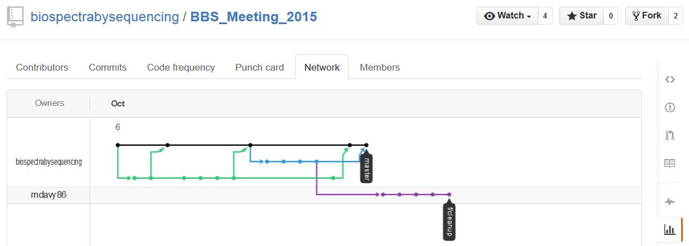
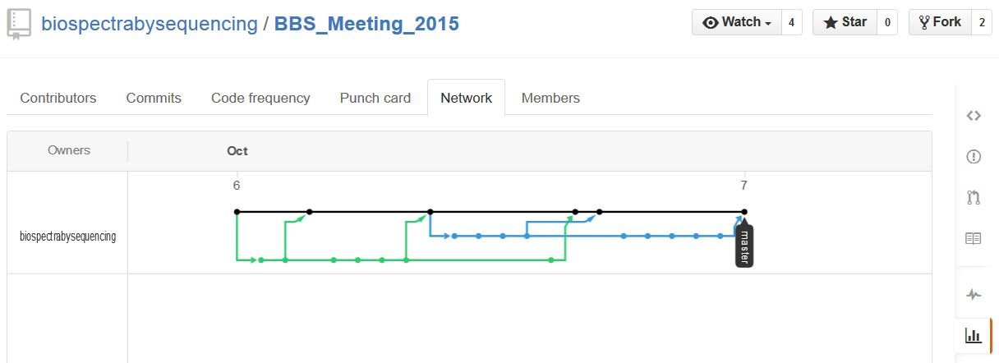

Fork and Clone
==============

A fork is a standalone copy (clone) of a repository that resides on github, so 
it is effectively just a clone that you own in the cloud. a clone is just a copy 
of a repository. 

* Fork - make a clone of a repository server side to a copy you own.
* Clone - make a copy of a repository client side

N.B. in order to significantly contribute to a project it is likely a clone will
be required,  whether it  is of  the source repository,  or a  fork of  a source
repository.

Over time the content in forks and clones will contain new contributions that 
are missing from the master `uptream` repository or from your fork of the master 
`upstream` repository which by definition call `origin`.

In this case we must `fetch` (download) and `merge` (join) remote branches, both 
commands can be run in a single `pull` command to fetch from and 
integrate new contributions.

* [git fetch documentation](https://git-scm.com/docs/git-fetch)
* [git merge documentation](https://git-scm.com/docs/git-merge)
* [git pull documentation](https://git-scm.com/docs/git-pull)

See the [git glossary](https://help.github.com/articles/github-glossary/) for 
definitions.

Branching
---------

The contibution model is;

* fork (copy) a github repository
* clone your copy to another machine
* Make a branch from `master` (git co -tb f/branch)
* Make contributions
* Push contributions to `origin` (git push origin f/branch)
* Make a pull request on github

We can see how a branch is developed and merged into `master` via the `network graph` (in github `Graphs => Network`).

The branch f/cleanup is 5 commits ahead of `master`. Hovering over specific nodes (commits) identifies the commit shasum.	



After completing a pull request the 5 commits are merged into `master`, and an additional commit is made for the pull requeset.
 



# Permissions

GitHub repositories have  owners and collaborators. Owners by  default have read
and write access to the repository as well as admin access. Collaborators may be
granted any level of  access from read, write or admin. The  access level may be
through team membership.

A  consequence of  this  is that  not  everyone  has direct  write  access to  a
repository, although  with the exception  of private repositories,  everyone has
read level access. This leads to the requirement of creating a copy that you own
and  therefore have  write  access to.  This  is  known on  GitHub  as making  a
**fork**.

When  you have  made a  contribution and  would like  it to  be included  in the
original source repository  you need to notify the owner  of that repository and
share the changeset  (your changes packaged in differences form).  This is known
as creating a **pull request**.

# Choosing - Fork vs Clone

When should I *clone* and when should I *fork*?

## Fork

You should fork a repository *if*:

* you do not own, or have write  access to the repository you wish to contribute
  to
* you feel that you changes will warrant a review by someone
* you wish  to make significant changes  to the source repository  while sharing
  the branches with a smaller team

## Clone

You should  clone a repository  *if* you own the  repository **and** one  of the
following:

* the changes you wish to make are minor e.g. spelling mistakes
* you intend to make a branch for a large change
* you do not wish to have your code reviewed as you are an expert

# Forking

To  create a  fork you  need to  interact with  GitHub, either  through the  web
interface or a client that uses the API.

The simpler of the two is likely the web interface and where forking is achieved
by clicking the **Fork**  button in the top right of the  repository you wish to
fork. If there  are multiple accounts/organisations that the fork  can be copied
to a option panel will appear with which to select the account to copy to.

Once forked, your  copy can be cloned  or edited in the browser  before making a
pull request.

Using this repository and your fork (copy) as an example, cloning can be achieved by

```bash
## substitute GITHUB_USER for your github user account
git clone git@github.com:[GITHUB_USER]/BBS_Meeting_2015.git
```

# Forking and keeping up to date

Once you  fork a  repository the  copy that you  own has  the potential  to fall
behind commits that are  made to the source repository. The  solution to this is
to merge in **upstream** changes after they happen. This requires a little setup
before it can be achieved.

Again using this repository and your fork as an example

```bash
## substitute GITHUB_USER for your github user account
git clone git@github.com:[GITHUB_USER]/BBS_Meeting_2015.git

cd BBS_Meeting_2015 

## Setup your upstream remote
git remote add upstream git@github.com:biospectrabysequencing/BBS_Meeting_2015.git

## Ssnity check remotes...
git remote -v
```

This  sets up  the clone  to  understand where  to obtain  the upstream  changes
from. The name upstream  is only used in the command as  convention and any name
can be used.

After  some changes  are committed  to  the source  repository and  you wish  to
integrate them. This is explained by the GitHub
[help topic](https://help.github.com/articles/merging-an-upstream-repository-into-your-fork/)
but given the setup caried out above the following commands and 
[these](https://help.github.com/articles/syncing-a-fork/) are equivalent.

```bash
## Move to master branch
git checkout master

## Pull latest master commits from upstream 
git pull upstream master

## Push latest master commits into your origin  
git push origin master
```

## Advanced

There is a possibility of a conflict and the GitHub 
[help topic](https://help.github.com/articles/resolving-a-merge-conflict-from-the-command-line/)
will explain the steps required to resolve.

In case you wish to check for conflicts (remembering that a pull == fetch + merge)

```bash
git checkout master
git fetch upstream master
git merge-tree $(git merge-base upstream/master master) master upstream/master
```

or the changes

```bash
git checkout master
git fetch upstream master
git diff HEAD...upstream/master
```

To complete the integration and merge the upstream changes

```bash
git merge upstream/master
```

As a useful alias for checking conflicts

```bash
git config --global alias.drymerge '!f() { git merge-tree $(git merge-base $2 $1) $1 $2; }; f'

git drymerge master upstream/master | grep -A3 'changed in both'
```
