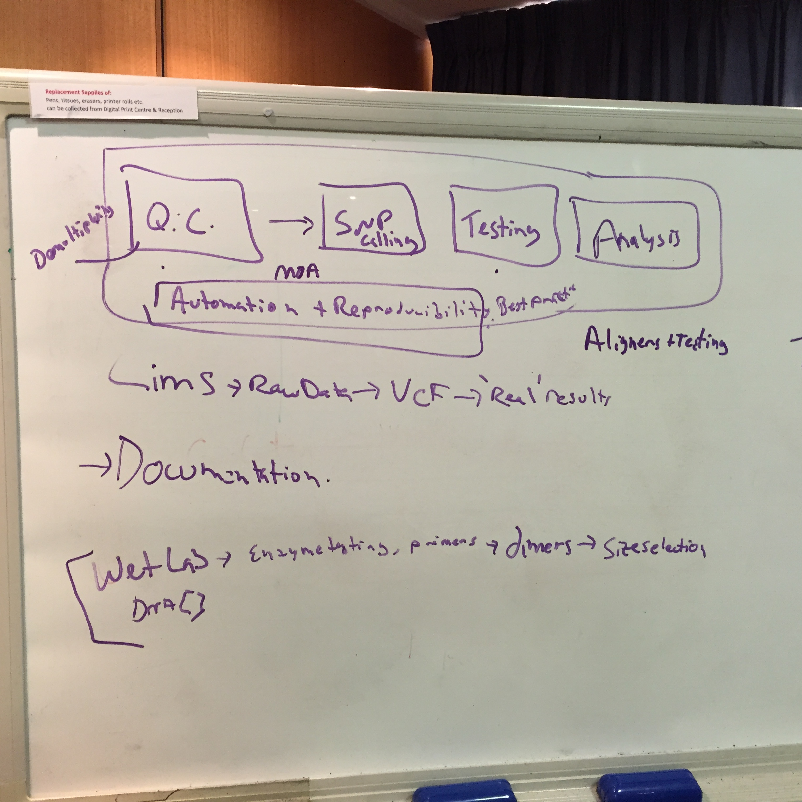

## BBS Meeting

**present**

Introduction by Rob Elshire

* Future problems solvers - introduce ideas without prejudice
  - egalitarian meeting
* Setup a space on [GitHub](https://github.com) and [Gitter](https://gitter.im)

MBIE project is missing a bit that is the toolkit to capture the audit trail to record what is done.

Sorting this out... today is a technical discussion

### MapNet 2014

Last year we spent time discussing this at MapNet 2014.

* Getting on GitHub was a barrier - action this **before** 11am
* Some time out/moved from AgResearch
* GitHub space needs organisation

#### What we have
* scripts from Cornell
* documentation from Mingsu

#### What we need
* pre TASSEL QC
  - Mingsu has done some work
  - Patrick Biggs (not present) has generated some
  - Justin Borwitz @ANU also done some
* Need to integrate this work

## What do we want to get out of this?

* What itches need scratching
* personal interests
* job overlap

Setting up best practice and technology transfer.

**Rob**

* automatability
* reproducibility
* getting it out there and available
* CRI and NZGL platform

**Rudiger**

* work within the MBIE project
* end to end trace

**Shane**

* problem solver and programmer

**Tony**

* BioIT provision
* provide and environmnet that is useful
* organisation
* project management

**Naumann**

* What can Bioinformatics@AgResearch do as a team
* Team leader

**Marcus**

* what is going on? - save effort
* reproducible research
* unit testing and tool evalutation
* best practice

**Mingshu**

* wish unified platform for researchers and analysts
* small country - maximise leverage
* discoverability

**Milan**

* feed data and have a publication

****

* User and exploit

**Roger**

* data platform
* genome assembly
* understand science and plant breeding programmes and applications

**Helge**

* automation to make us competitive
* best practice
* Kea and integration for samp

**Ruy**

* new comer
* steps through pipeline
* QC
* multivariate stats approaches and effects

**Rachel**

* pipeline runner
* accuracy - are they working as expected

**Aurelie**

* Bacteria - new area
* learning new things
* using Github for reproducible science

**Cecilia**

* standardisation
* lab practice and effects of results
* best practice wet and dry labs

** Phil **

* delinearise
* VISG 2 informed decisions for project plan
* modularisation of a pipeline
* exome capture using same/similar tools
* assay tools for end user needs
* validation component
  - best practice
  - biologists require a level of confidence form output

** Rob **

* linkages and feedback with down stream analysis
* down stream and upstream communications
* solve the blindsiding

### A modular approach

Samples are different...

### TASSEL

* hackathon
* uniq pipeline is deprecated

### Stacks

* slow compared to
* small overlap

## Variant calling

* small overlap between tools
* TASSEL workflow discussion - compressing reads -> tags -> reads per sample to genotyping
* sequencing depth per sample?
* not in scope
* discussion
* GBS X?

### Boxes...

Rob drawing boxes on the whiteboard
* purple to match Phil's shirt ;)
* areas to work on
* capturing what is important

#### Areas

1. QC
  - demultiplexing
2. SNP calling
3. Testing
4. Analysis

Across board is *automation*, *reproducibility*, *best practice* and *documentation*.

LIMS - > raw data -> VCF - > 'real' results

* rabbit hole discussion about demultiplexing and snp calling.

* 1 - 3 have common ground as do the across the board - these are the **core**

* documentation - need for wet and dry versions
* moa == automation and reproducibility

**Analysis**

Phil asked direction of TASSEL 5 dev.

* TASSEL 5 use case is land races - out breeding
* Are they amendable to community derived code? - yes - a reason for BBS approach.

## creating sub projects

To enable some distributed workflows within git.

## per species best practices

We are dealing with biology, different organisms have different volumes of resources, and hence best practice.

## Steering committee

We could do with one.

What should they do.

**Steering** not *oversight*

* IP
* Contributor agreement
* Resourcing

Naumann and Helge are CRI go-to people.
